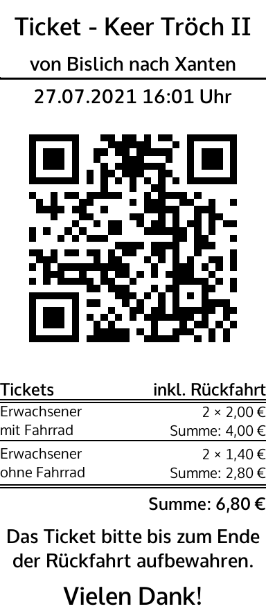

# FerryTix Receipt Generator
Generate receipts for ticket sales with the Python Imaging Library (Pillow).

### Example
To generate a FerryTix receipt for a simple ticket with return journey, use the following code:
```python3
from receipt_generator import ReceiptPrinter

receipt_data = [
    {
        "margin": 10
    },
    {
        "title": "Ticket - Keer Tröch II"
    },
    {
        "margin": 10
    },
    {
        "subtitle": "von Bislich nach Xanten"
    },
    {
        "margin": 5
    },
    {
        "margin": 7,
        "hbar": 4
    },
    {
        "subtitle": "27.07.2021 16:01 Uhr"
    },
    {
        "qrcode": 'tcuEX+ygT1OmQ0sd8KUr7Q=='
    },
    {
        "margin": 7
    },
    {
        "tickets": {
            "return": True,
            "sum": "6,80 €",
            "positions": [
                {
                    "title": "Erwachsener",
                    "subtitle": "mit Fahrrad",
                    "single_fare": "2,00 €",
                    "count": 2,
                    "sum": "4,00 €"
                },
                {
                    "title": "Erwachsener",
                    "subtitle": "ohne Fahrrad",
                    "single_fare": "1,40 €",
                    "count": 2,
                    "sum": "2,80 €"
                }
            ]
        }
    },
    {
        "margin": 10
    },
    {
        "subtitle": "Das Ticket bitte bis zum Ende"
    },
    {
        "subtitle": "der Rückfahrt aufbewahren."
    },
    {
        "margin": 10
    },
    {
        "title": "Vielen Dank!"
    }
]

printer = ReceiptPrinter()
printer.print_data(receipt_data)
```

 Alternatively, you can load the example from `receipt.yaml`:
```python3
from receipt_generator import ReceiptPrinter

printer = ReceiptPrinter()
printer.print_stream('receipt.yaml')
```

### Example Output

